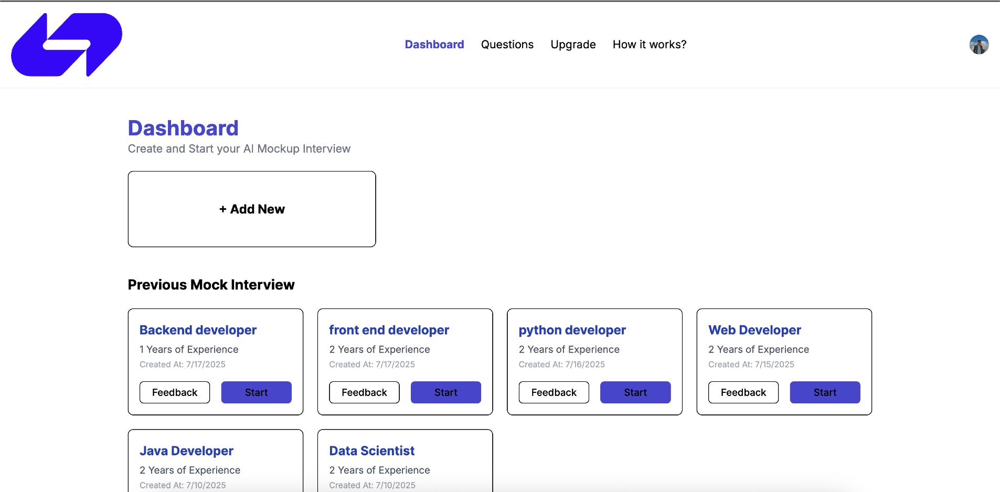

# 🤖 AI Mock Interview Generator

An AI-powered mock interview platform built with React and Google Gemini API. This project allows users to input job details and receive dynamically generated interview questions, helping job seekers prepare effectively for technical and behavioral interviews.

---

## 🚀 Features

- 🧠 Integrates with **Gemini API** to generate smart interview questions
- 💬 Dialog form for users to input job details like position, experience, and description
- 📄 Questions stored in **PostgreSQL** using **Drizzle ORM** and **Neon**
- 💾 Backend powered by **Next.js App Router**
- 🔐 Secure user sessions and unique mock interview history

---

## 📸 Screenshots

<div align="center">
  
  
</div>


---

## 🛠️ Tech Stack

- **Frontend**: React + Tailwind CSS
- **Backend**: Next.js 14 (App Router)
- **Database**: PostgreSQL with Neon + Drizzle ORM
- **AI API**: Gemini API from Google
- **Deployment**: Vercel 
- **Authentication**: Clerk
---

## ⚙️ How to Run the Project Locally

### 1. Clone the Repository

```bash
git clone https://github.com/Adheesh49/ai-mock-interview.git
cd ai-mock-interview
```

### 2. Install Dependencies

```bash
npm install
# or
yarn install
```

### 3. Setup Environment Variables

Create a `.env.local` file in the root directory and add:

```env
GEMINI_API_KEY=your_gemini_api_key
DATABASE_URL=your_neon_postgres_url
NEXTAUTH_SECRET=your_next_auth_secret
```
> Make sure to set up Neon database and configure Drizzle schema accordingly.

### 4. Run the Development Server

```bash
npm run dev
# or
yarn dev
```

Visit [http://localhost:3000](http://localhost:3000) to access the app.

---

## 📁 Project Structure

```
ai-mock-interview/
├── app/                # Next.js app router components
├── components/         # Reusable UI components
├── lib/                # DB, utils, and API logic
├── drizzle/            # Drizzle ORM schema
├── public/             # Static files
├── .env.local          # Environment variables
├── package.json
└── README.md
```

---

## 🌍 Live Demo

The AI Mock Interview platform is live and ready to use!

🔗 **Visit here**: [https://ai-mock-interview-sepia-sigma.vercel.app/](https://ai-mock-interview-sepia-sigma.vercel.app/)

---

## 🧑‍💻 Author

**Adheesh Raj Pandey**  
[GitHub](https://github.com/Adheesh49) | [LinkedIn](https://www.linkedin.com/in/adheeshrajpandey)

---

## 🙌 Contributions

Pull requests are welcome! Feel free to fork and submit improvements or new features.

---

## ⭐️ Support

If you find this helpful, consider giving it a ⭐ on GitHub!
